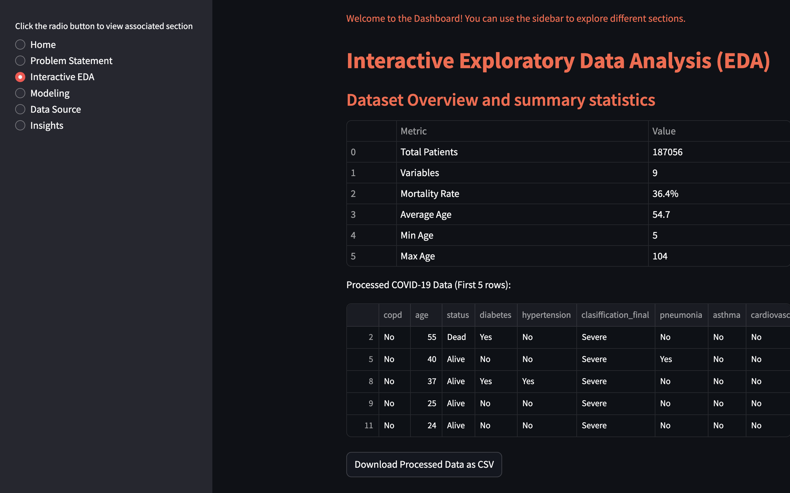
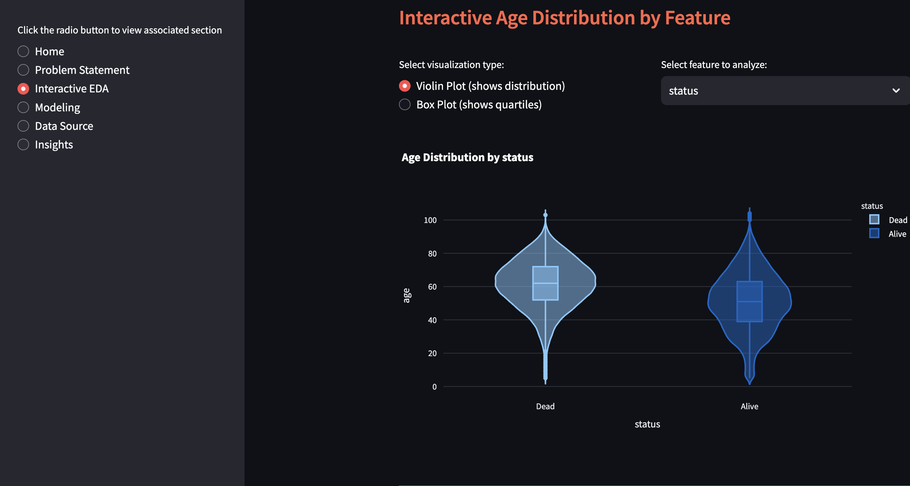
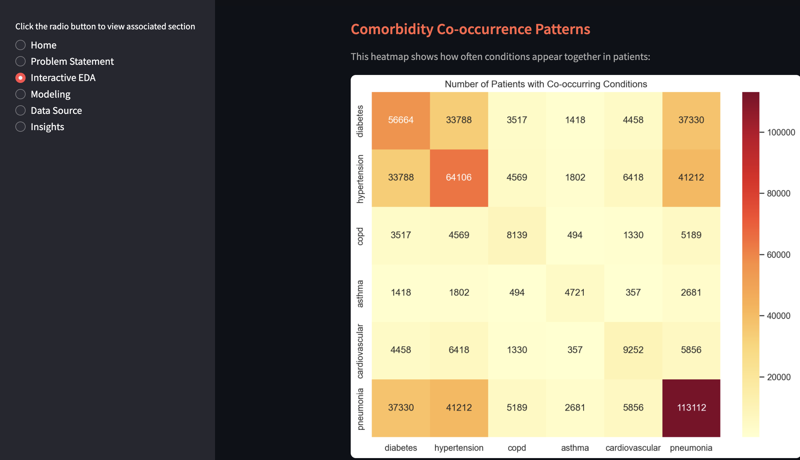
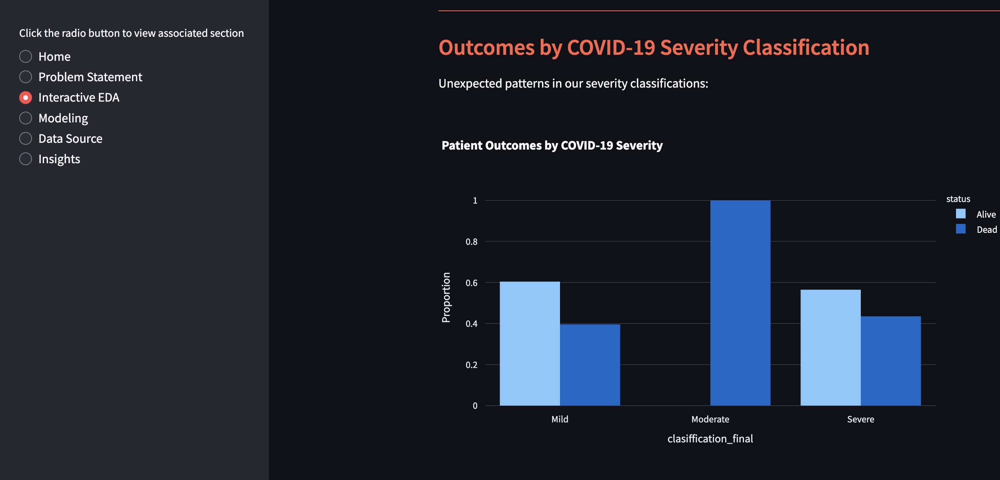
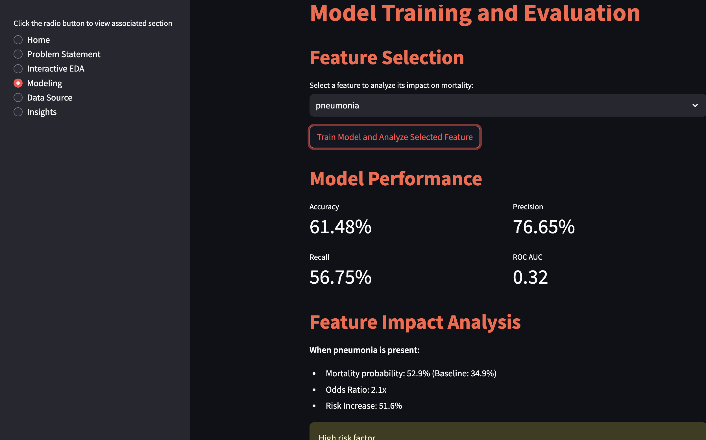

🏥 Hospitalized COVID-19 Patients Dashboard

This project presents an interactive data dashboard analyzing hospitalized patients outcomes for COVID-19 patients in Mexico. 

It was developed as part of the Build Fellowship (February Cohort) under the mentorship of Pratyrush Kundu with Nancy Odhiambo as a student consultant.

The goal was to explore how demographic and comorbidity factors influence the severity and outcomes of COVID-19 hospitalized cases using a well-structured exploratory data analysis data modeling and dashboard visualizations.

📊 Dashboard Highlights
Developed using Streamlit the dashboard provides interactive insights across multiple dimensions:

1. Age and Outcomes Visualization

Violin and box plots to show how age distribution correlates with outcomes.

Clear trends reveal increased ICU admissions, intubations and death with older age.

2. Severity vs Outcome
   
Grouped bar chart compares patient severity levels (Mild, Moderate, Severe) against outcomes (Alive, Dead).

Moderate cases surprisingly had a higher death rate than severe ones indicating care disparities.

3. Correlation Analysis
   
Interactive heatmaps reveal variables that correlate negatively with patient survival.

Features like pneumonia, classification level (moderate) show strong relationships with mortality.

4. Comorbidity Influence

Heatmaps highlight co-occurrence patterns among comorbidities.

Diabetes and hypertension frequently co-occur and increase mortality risk.

📸 Dashboard Preview

🔍 Modeling & Analysis

Preprocessing: Handled missing values (97/98/99), outlier removal, and binary encoding.

Feature Engineering: Grouped classification levels and transformed comorbidity indicators.

Model Used: Logistic Regression

Accuracy: ~82%

ROC AUC: High

Odds ratios and feature contributions were interpreted to highlight clinical risks.

⚙️ Technologies Used

Tool Used

Python	

Pandas	

Streamlit

Plotly	

Seaborn	

Scikit-learn	Model training & evaluation

Git & GitHub	Version control and collaboration

🧪 Project Structure

📁 Hospitalized-Covid_19-Patients-dashboard
├── EDA_in_streamlit.py       
├── covid_data.csv            
├── requirements.txt         
├── README.md                 
└── .gitignore                

🔍 Data Quality Findings

Data Cleaning Challenges: Removed unknown values (97, 98, 99)

Outlier Management: Removed 6,053 age outliers (~3.24%)

Class Imbalance: Mortality rate was 36.4%, addressed using balanced modeling

⚠️ Clinical Risk Factors

Strongest Predictors:

Pneumonia

Diabetes-Hypertension combo

Age > 60

Unexpected Findings:

Asthma showed potential protective effect

Moderate cases had higher mortality than severe ones

🏥 Operational Applications

Clinical Support: 82% recall for mortality prediction

Resource Planning: ICU forecasting and identification of high-risk profiles

⚠️ Limitations

Lack of detailed lab/treatment data

Dataset includes hospitalized patients only

Potential underreporting for non-hospitalized fatalities

👥 Contributors

Nancy Odhiambo – Student Consultant, Data Science & Analytics

Pratyrush Kundu – Project Supervisor, Build Fellow

📌 Acknowledgment

The dataset used in this project was provided by the Mexican Government, covering clinical data on COVID-19 positive cases across the country.

🚀 Getting Started

# Clone the repo

git clone https://github.com/Nancy-Odhiambo/Hospitalized-Covid_19-Patients-dashboard.git
cd Hospitalized-Covid_19-Patients-dashboard

# Install dependencies

pip install -r requirements.txt

# Run the dashboard

streamlit run EDA_in_streamlit.py

📬 Contact

For questions, feedback, or collaboration:

GitHub: Nancy Odhiambo

Email: odhiambn@mail.gvsu.edu
